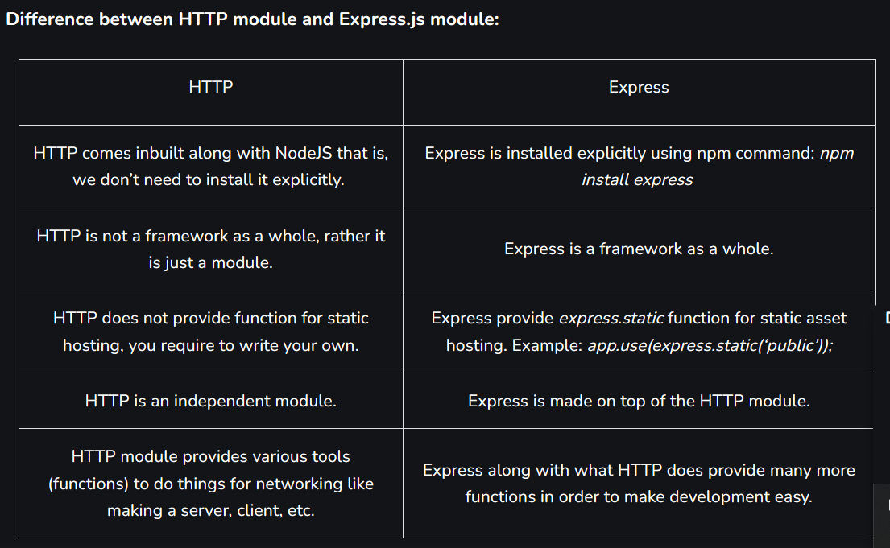

GET and POST both are two common HTTP requests used for building REST API's. POST requests are used to send large amount of data.

Post method facilitates you to send large amount of data because data is send in the body. Post method is secure because data is not visible in URL bar but it is not used as popularly as GET method. On the other hand GET method is more efficient and used more than POST.

Difference Between GET and POST method : 

Generally the POST method is hides the data that is entered in the form while the GET method explictily shows the data which is vunerable.

The data that is sent through the POST method is retrived using a middelware functions called body-parser module which contains the urlencoded() method which is used prases the argument.

        urlencoded({extended : false})

PUT and DELETE are the two other methods in express which is used for different purposes.
These medthod can access the request objects.

PUT - PUT is used to update the existing resource on the server and it updates the full resource.

DELTE - DELETE Method is used to delete the resources from a server. It deletes resource identified by the Request-URI.